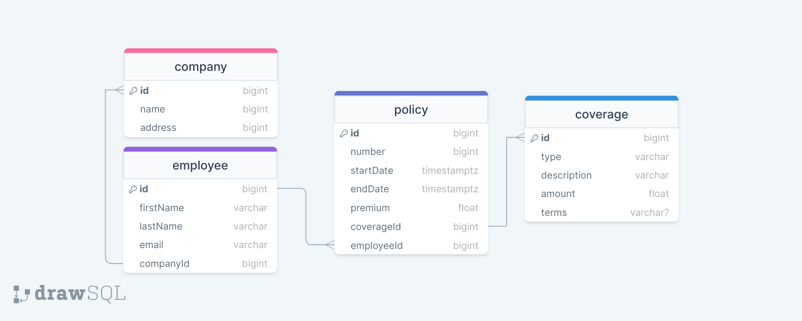

# Small project to kickstart interview

This project is aim to fill some gap that I have regarding some tech that grape is using.

## Getting Started

This project is a simple project that is using nodejs, graphql, postgresql to create a simple API.

### Prerequisites

What things you need to install the software and how to install them

```
nodejs
postgresql
```

### Installing

follow these steps to install prisma [prisma](https://www.prisma.io/docs/getting-started/setup-prisma/start-from-scratch/relational-databases-typescript-postgresql)

### Simple Schema 

This is the simple schema that I have created for this project. It is just to showcase the use of prisma and graphql.

